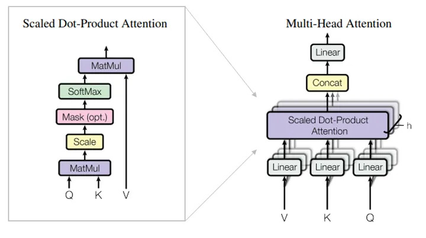
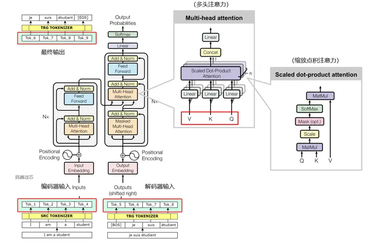
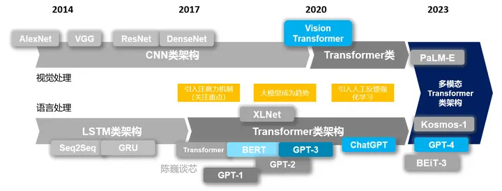

# Transformer与注意力机制

"Attention is All You Need"（Vaswani, et al., 2017）是2017年最有影响力的NLP论文之一。这篇论文提出了很多对注意力技术的改进，在循环网络单元的情况下实现seq2seq建模，并且提出新的Transformer架构。

Transformer在数学上是大矩阵的计算，通过计算不同语义之间的关联度（概率）来生成具有最高概率的语义反馈。RNN、LSTM或者GRU主要是进行模式识别，而Transformer不仅仅是一个矩阵计算。Transformer事实上还承载着语义关联的重要功能。

Transformer中的核心组件是多头自注意机制模块。Transformer将输入的编码表示视为一组键值对（K，V），两者的维度都等于输入序列长度。

多头注意力机制的模块内采用缩放点积注意力机制：输出是值的加权和，其中分配给每个值的权重由查询（Q）与所有键（K）的点积决定：

多头机制不是只计算一次注意力，而是并行运行缩放点积注意力算法。独立的注意力输出被Concat连接（矩阵连接，非计算）并线性转换为预期的维度。

原始的Transoformer包括编码器-解码器架构（GPT只有解码器结构）。编码器和解码器都是N个相同层的堆叠，源序列和目标序列（原始数据可以是图像或文本）都经过嵌入层以产生相同维度的数据。

单个编码器层由多头注意力块（含有Q、K、V输入）和一个前馈模块组成。解码器层由多头注意力块开始，后面是一个连接编码器堆栈输出的多头注意块（即查询Q来自解码器，而值V和键K来自编码器），然后是一个前馈模块，最终在 Softmax（选择概率最高的分类或词汇）模块进行分类器输出。

随着Transformer技术的发展，Transformer也使用在了CV领域，并形成了Vision Transformer技术。

